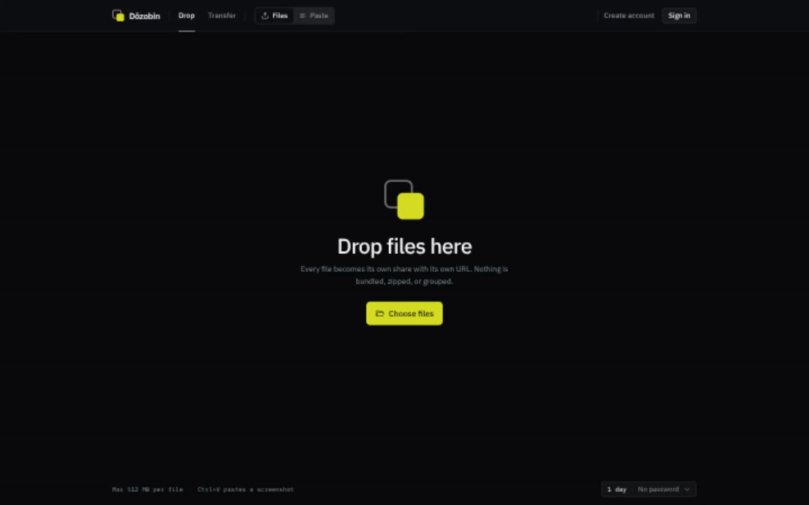
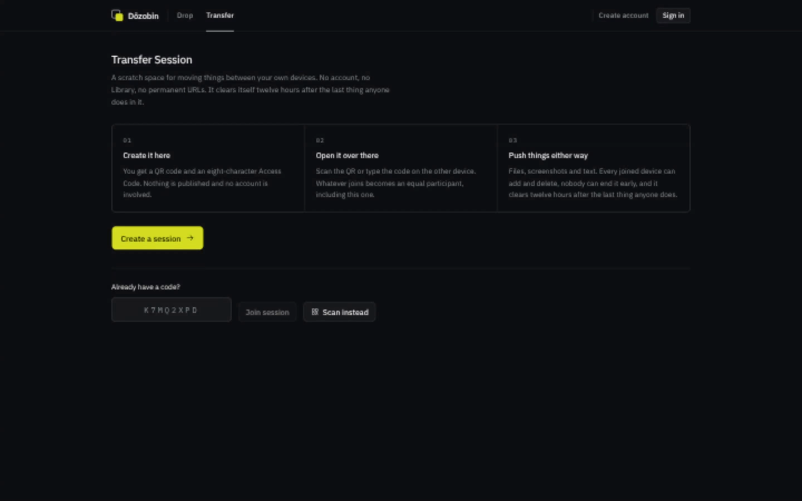

# Dōzobin

Dōzobin is a self-hosted workspace for sharing files, screenshots, and text. Regular Shares get unlisted URLs; Transfer Sessions move files and text between devices, then delete themselves after inactivity.

The app runs on Laravel 13, Inertia 3, React 19, and MariaDB or another Laravel-supported database.

## Screenshots



_Drop workspace for file shares and screenshots._



_Accountless Transfer Sessions can be created or joined with an Access Code._

## What it does

- File Shares and Pastes with expiration, optional password protection, and Member Libraries
- Accountless Transfer Sessions joined by QR code or an eight-character Access Code
- Configurable Guest access, registration, file rules, storage quotas, and cleanup windows
- Separate malware-scanning queue with ClamAV support
- Administration screens for Members, uploads, sessions, and installation settings

## Requirements

- PHP 8.5 or newer with the extensions checked by the installer
- Composer 2
- Node.js 24 and pnpm 10
- MariaDB 11, MySQL 8, PostgreSQL, or SQLite
- A queue worker and the Laravel scheduler

## Local setup with DDEV

```sh
ddev start
ddev exec composer setup
```

Open the DDEV URL and follow the installer. DDEV already runs Vite, both queue workers, and the scheduler.

## Docker production install

The supported container runs Nginx, PHP-FPM, both queue workers, and the scheduler. It applies database migrations before those processes start. Copy `compose.production.yaml`, provide `APP_KEY`, `APP_URL`, `DB_PASSWORD`, and `DB_ROOT_PASSWORD`, then start it with Docker Compose or import the service into Coolify.

```sh
docker compose -f compose.production.yaml up -d
```

Uploads use the persistent `app-data` volume at `/data/files` by default. Set `FILESYSTEM_DISK=s3` and the S3 variables to use AWS S3, MinIO, or Hetzner Object Storage instead. See [Docker deployment](docs/operations/docker.md) for the complete configuration and upgrade procedure.

Published images are anonymously pullable from `ghcr.io/rexlmanu/dozobin`. Pin an immutable version such as `0.1.0-alpha.2` instead of relying on a moving tag. The release and package-visibility flow is documented in [publishing releases](docs/operations/releases.md).

## Manual production install

Point the web server at `public/`; never serve the repository root. Then install the locked dependencies and compile the frontend:

```sh
composer install --no-dev --classmap-authoritative
pnpm install --frozen-lockfile
pnpm run build
php artisan key:generate
php artisan migrate --force
php artisan optimize
```

Set `APP_ENV=production`, `APP_DEBUG=false`, the public HTTPS `APP_URL`, database credentials, a working mail transport, and `SESSION_SECURE_COOKIE=true`. Keep `storage/` and `bootstrap/cache/` writable by the PHP process.

Two queue workers keep scanning from blocking cleanup jobs:

```sh
php artisan queue:work --queue=default --sleep=1 --tries=3 --timeout=300
php artisan queue:work --queue=scans --sleep=1 --tries=4 --timeout=300
```

Run `php artisan schedule:run` once per minute, or supervise `php artisan schedule:work`. Restart both workers after every deployment with `php artisan queue:restart`.

The first request opens a three-step installer unless `DOZOBIN_SKIP_INSTALLER=true`. Read [first-run installation](docs/operations/first-run-installation.md), [Docker deployment](docs/operations/docker.md), and [maintenance and malware scanning](docs/operations/maintenance-and-malware-scanning.md) before exposing the host.

## Search indexing

Production installations allow indexing by default. Only the Drop Workspace appears in `sitemap.xml`; auth pages, administration, Transfer Sessions, and unlisted Share URLs return `noindex` headers and metadata.

Set `SEO_INDEX=false` for a private installation. `robots.txt` then blocks the whole host and `sitemap.xml` stays empty. Set `SEO_DESCRIPTION` to describe your instance and `SEO_IMAGE_URL` to an absolute 1200 by 630 social-card URL.

## Before opening the server

Work through [RELEASE_CHECKLIST.md](RELEASE_CHECKLIST.md). It covers HTTPS, workers, backups, mail, storage limits, abuse controls, and search-engine submission.

## Development checks

```sh
composer ci:check
```

That command runs PHP formatting, PHPStan, Pest, ESLint, Prettier, and TypeScript checks. See [CONTRIBUTING.md](CONTRIBUTING.md) before sending a pull request.

## Security and license

Report a vulnerability through the process in [SECURITY.md](SECURITY.md). Dōzobin is available under the [MIT License](LICENSE).
